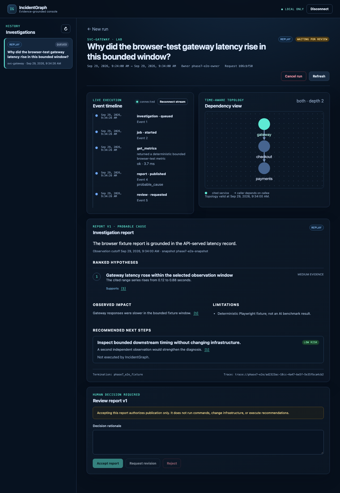

# IncidentGraph

IncidentGraph is a local, evidence-grounded infrastructure incident investigator. It combines a
bounded LangGraph workflow, LangChain model and tool contracts, Neo4j graph-enhanced retrieval,
durable PostgreSQL execution, and a React incident console.

The project is intentionally read-only: it can investigate controlled laboratory incidents and
publish cited reports, but it cannot execute remediation, control Docker, generate arbitrary
PromQL/Cypher/shell commands, or access production systems.

## Highlights

- 12-node stateful investigator with eight registered read-only tools.
- PostgreSQL-backed queue leases, fencing, checkpoints, resumable review, cancellation, and
  immutable report versions.
- Neo4j topology plus versioned vector and full-text retrieval over a 37-document corpus.
- Authenticated FastAPI API, resumable SSE, and a React evidence-review console.
- Immutable replay captures, sealed evaluation inputs, and committed per-case results.
- Loopback-only Docker Compose runtime with standard and low-resource profiles.
- Deterministic CI, security checks, backup/restore, and offline regression verification.

## Console preview



This screenshot comes from the deterministic browser/API/PostgreSQL demo. It shows the product
workflow with a labeled fixture; diagnosis-quality measurements are reported separately below.

## Architecture

```text
React console
    |
    v
Authenticated FastAPI  ------> PostgreSQL
    |                            queue, events, checkpoints,
    v                            evidence, reviews, reports
Durable worker + LangGraph
    |             |
    v             v
Neo4j          Immutable captures / local telemetry
topology +     (bounded, read-only observations)
documents
```

PostgreSQL is the authority for durable execution. Neo4j stores time-valid topology and document
indexes. The model may choose only registered observations; deterministic code owns identity,
authorization, query templates, budgets, citation validation, and the synthetic-lab evaluation
policy. Detailed diagrams are in [docs/portfolio/DIAGRAMS.md](docs/portfolio/DIAGRAMS.md).

## Quick start

Requirements: Docker Desktop, Node 24.13.1, npm 11.8.0, and `curl`. The bootstrap script installs
project-local uv 0.12.17 and Python 3.12.14 without replacing the system Python.

```bash
git clone https://github.com/mohammadrezakarami/incidentgraph.git
cd incidentgraph
./bootstrap.sh
.venv/bin/python scripts/create_local_env.py
make doctor
make up
make migrate
make smoke
```

`create_local_env.py` writes an ignored mode-0600 `.env` and prints a one-time bearer token. Keep
the plaintext token outside Git. The generated configuration binds exposed services to loopback.

To initialize the graph and corpus:

```bash
make seed
make ingest
make verify-ingestion
```

To run the API and console, use separate terminals:

```bash
make api
make worker
make frontend
```

Then open <http://127.0.0.1:5173>. Starting a new model-backed investigation requires an explicitly
configured approved local provider. With `MODEL_PROVIDER=disabled`, existing records remain
viewable and new model-backed work fails closed with a configuration error.

For an interactive laboratory investigation, create an immutable observation first and then select
the newest snapshot in the console:

```bash
make lab-up
make scenario SCENARIO=deployment_regression
```

The scenario command injects a bounded fault, records telemetry, verifies recovery, and stores an
agent-readable capture without the evaluator label. The console locks the investigation window to
that snapshot before queueing it. Direct live-telemetry investigations are not exposed until a
separately reviewed live adapter is configured.

## Main commands

```bash
make doctor
make bootstrap
make up                         # RESOURCE_PROFILE=standard or low
make seed
make ingest
make smoke
make scenario SCENARIO=healthy
make capture SCENARIO=healthy
make demo                       # real browser/API/PostgreSQL flow; zero model calls
make test
make test-offline
make test-integration
make test-e2e
make evaluate-dev
make evaluate-test              # verifies committed v4 evidence; no model call
make report
make backup-app BACKUP=backups/incidentgraph-app.dump
make restore-app BACKUP=backups/incidentgraph-app.dump CONFIRM=RESTORE_INCIDENTGRAPH_APP_DB
make release-verify
make down
```

`make down` preserves database volumes. Destructive volume removal is a separate confirmation-
gated operation. First-time dependency, image, browser, and embedding-model downloads require a
network connection; once dependencies are cached, `make test-offline` performs no package or model
download.

The complete operations procedure is in
[docs/operations/RELEASE.md](docs/operations/RELEASE.md).

## Retrieval

Run a graph-enhanced query:

```bash
make retrieve \
  VARIANT=graph \
  SERVICE=gateway \
  QUERY="Gateway latency rose while cache hits fell. Which downstream service should be investigated?"
```

Verify the sealed fixture and run the development split:

```bash
make verify-retrieval
make test-retrieval-integration
make evaluate-retrieval-dev
```

On the sealed 20-question project-authored laboratory holdout, graph retrieval reached Recall@5
of 0.925, hybrid 0.9083, and vector 0.8833. The corpus contains 37 chunks, so these results do not
establish large-index performance or production generalization. Graph adjacency is evidence of
operational relationship, not causality.

## Evaluation

The final frozen evaluation contains 30 case variants over 11 post-repair laboratory capture
groups. A resumable zero-paid-cost run produced 120 per-job records across fixed and adaptive
workflows. The committed aggregate reports:

| Measure | Fixed | Adaptive |
|---|---:|---:|
| Top-1 diagnosis | 20/20 | 20/20 |
| Top-3 diagnosis | 20/20 | 20/20 |
| Appropriate abstention | 5/5 | 5/5 |
| False incidents | 0/5 | 0/5 |
| Task completion | 30/30 | 30/30 |

Citation validity, policy compliance, warm latency, and the retained branch-aware core coverage
target also passed. The written semantic review checked 69/69 supported atomic claims across 20
reports. That review was AI-assisted and is not independent human validation.

The variants share capture groups and are not independent production incidents. The local model
controls bounded observation order; trusted pre-registered code owns the synthetic-lab diagnosis
and citation content. Historical v1 and v3 failures remain committed under `artifacts/evaluation/`
to preserve the actual repair trail.

Verify the sealed inputs and committed result without calling a model:

```bash
make verify-phase9-v4-freeze
make evaluate-test
make report
```

The two retained notebooks contain the optional hosted-GPU procedures:

- [notebooks/phase5_evaluation.ipynb](notebooks/phase5_evaluation.ipynb)
- [notebooks/phase9_evaluation.ipynb](notebooks/phase9_evaluation.ipynb)

They use local open-source model serving inside the notebook runtime and do not configure a paid
provider. Normal tests and CI never start a stochastic model evaluation. To prepare a notebook
upload from a full clone, run the matching command in the repository root:

```bash
git bundle create incidentgraph-phase5.bundle main
git bundle create incidentgraph-phase9-v4.bundle main
```

Upload only the matching bundle in the notebook's first upload cell. The Phase 9 notebook checks
out the original frozen evaluation revision from that bundle and verifies its sealed source and
data before execution. Use a free T4 runtime; resumed progress archives belong in the separate
progress-upload cell. These are optional historical reruns, not additional independent test data.
The committed results can be verified with `make evaluate-test` without Colab or a model.

## Testing and release verification

```bash
make lint
make format-check
make typecheck
make test-frontend
make test-offline
make test-integration
make test-e2e
make release-verify
```

The deterministic browser test uses the real FastAPI/PostgreSQL lifecycle with a clearly labeled
fixture publisher. It verifies the product path, not diagnosis quality. Sanitized screenshots from
that flow are stored under `artifacts/portfolio/`.

Application metrics are exposed only to an authenticated operator. Optional tracing correlates API,
worker, model, and tool spans and applies recursive redaction before writing rotating local JSONL.
See [docs/operations/OBSERVABILITY.md](docs/operations/OBSERVABILITY.md) and
[docs/security/THREAT_MODEL.md](docs/security/THREAT_MODEL.md).

## Portfolio documentation

- [Final technical report](docs/portfolio/FINAL_TECHNICAL_REPORT.md)
- [Five-minute demo](docs/portfolio/DEMO_SCRIPT.md)
- [Architecture and state diagrams](docs/portfolio/DIAGRAMS.md)
- [Claims and evidence map](docs/portfolio/CLAIMS_EVIDENCE.md)
- [Technical defense](docs/portfolio/TECHNICAL_DEFENSE.md)
- [Final readiness](docs/portfolio/FINAL_READINESS.md)
- [Release and operations](docs/operations/RELEASE.md)
- [Security tests](docs/security/SECURITY_TESTS.md)

## Limitations

- This is a personal controlled-laboratory project, not a production deployment.
- The corpus, captures, questions, and labels are small and project-authored.
- The final variants share capture groups, and the semantic review was not independent.
- The retained 85.14% coverage result applies to the frozen core scope, not the whole repository.
- The browser demo uses a deterministic zero-model fixture and is not an AI-quality benchmark.
- There is no enterprise identity, public endpoint, production credential, automatic remediation,
  sustained load study, or real-organization MTTR claim.

## License

Source is available for inspection under the all-rights-reserved terms in
[LICENSE.md](LICENSE.md); this is not an open-source license.
