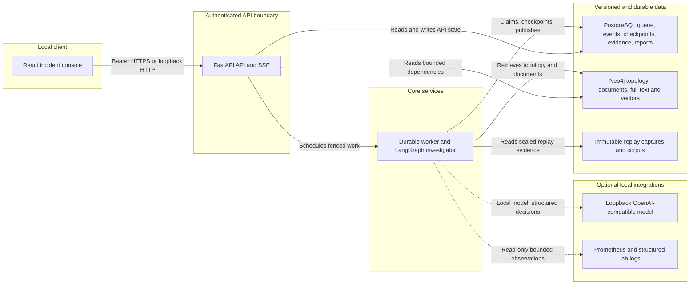

# IncidentGraph architecture and agent state

These diagrams are repository-native Mermaid so GitHub can render them without a separate design
service. They are derived from the implemented API, worker, persistence, retrieval, and LangGraph
assembly; they are not a planned-system sketch.

## Runtime architecture and evidence flow

The API and worker are separate processes. PostgreSQL is the authority for queue leases, events,
review decisions, checkpoints, and immutable report versions. Neo4j provides time-valid service
relationships plus document vector/full-text indexes. The model can select only registered,
bounded observations; deterministic code owns authorization, query templates, budgets, citation
checks, and the synthetic-lab v4 diagnosis policy. No component has a remediation tool or Docker
socket.

The laboratory capture pipeline and frozen evaluator are upstream/offline workflows. They create
hashed replay captures and score committed result records, but they are intentionally not on the
interactive request path shown above.

## Investigator state machine

```mermaid
stateDiagram-v2
    direction LR

    [*] --> ValidateRequest
    ValidateRequest --> ResolveContext: authorized
    ValidateRequest --> Failed: invalid request
    ResolveContext --> PlanObservation: context resolved
    ResolveContext --> Failed: unresolved target
    PlanObservation --> EnforcePolicy: tool proposed
    PlanObservation --> DraftReport: stop or limit
    EnforcePolicy --> ExecuteTool: allowed
    EnforcePolicy --> PlanObservation: bounded retry
    EnforcePolicy --> DraftReport: blocked or exhausted
    ExecuteTool --> NormalizeEvidence: result
    NormalizeEvidence --> UpdateHypotheses: persisted references
    UpdateHypotheses --> CheckSufficiency: ranked state
    CheckSufficiency --> PlanObservation: more evidence useful
    CheckSufficiency --> DraftReport: sufficient or hard limit
    DraftReport --> ValidateReport: typed report
    ValidateReport --> DraftReport: one repair
    ValidateReport --> HumanReview: valid report
    ValidateReport --> Finalize: repair exhausted
    HumanReview --> DraftReport: revision requested
    HumanReview --> Finalize: accept or reject
    Failed --> Finalize
    Finalize --> [*]
```

`HumanReview` is a durable LangGraph interrupt. Waiting clears the worker lease; resumption uses the
server-stored decision reference and a fresh fenced work item. The observation and report-repair
cycles are bounded by model calls, tool calls, rounds, tokens, time, and approved cost.

## Trust boundaries

- The browser receives only owner-scoped API data and sends the bearer token in the authorization
  header, never in a URL.
- The runtime receives agent-readable captures and corpus documents, not evaluator labels.
- The LLM never supplies identity, authorization scope, arbitrary PromQL, Cypher, or shell text.
- Review acceptance authorizes report publication only; it cannot execute recommendations.
- Local tracing is opt-in and redacts before export. It is not an authorization channel.

## Source anchors

- API and access boundary: `src/incidentgraph/api.py`, `src/incidentgraph/auth.py`
- Durable execution: `src/incidentgraph/persistence.py`, `src/incidentgraph/durability.py`
- Investigator graph: `src/incidentgraph/investigator.py`
- Read-only tool registry: `src/incidentgraph/investigation_tools.py`
- Retrieval and graph provenance: `src/incidentgraph/retrieval.py`
- Console: `frontend/src/App.tsx`, `frontend/src/api.ts`
